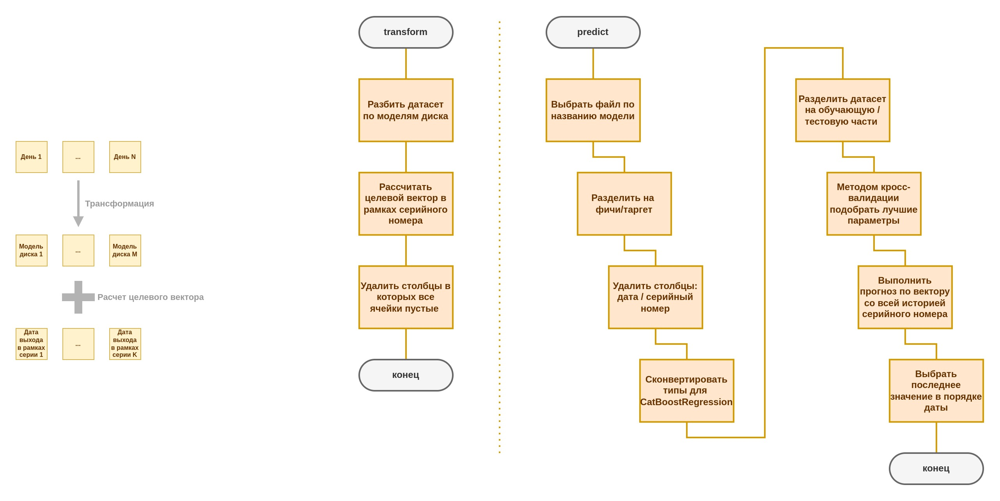

# DiskPredict

`DiskPredict` — это утилита командной строки для обучения, дообучения и прогнозирования отказов жёстких дисков на основе моделей машинного обучения.

## Описание

Эта утилита предоставляет три основные команды для работы с моделями машинного обучения:

- **transform**: Составление БД на основе исходного датасета
- **apply**: Добавление нового csv в существующую БД.
- **predict**: Прогнозирование состояния жёсткого диска на основе модели и серийного номера.

## Алгоритмы команд



## Запуск окружения
```bash
cd project_folder
python -m venv venv
(windows) venv\Scripts\activate
(linux) source venv/bin/activate
pip install -r requirements.txt
```

## Как создать с нуля

1. Подготовить исходный датасет в папку рядом со скриптами (например, ``data_example``)
```txt
 - data_example/
   - file_1.csv
   - ...
   - file_N.csv
 - cli.py
 - target.py
 - transform.py
 - predict.py
```

2. Запустить утилиту командой 
```bash
python cli.py
```

3. Составить базу данных на основе датасета. Указать путь до папки с csv-файлами. Поддерживает *
```bash
DiskPredict> transform ./data_example
```

4. Выполнить прогноз по конкретной модели и серийному номеру
```bash
DiskPredict> predict ST8000NM0055 ZA171ADG
```


## Как добавить в существующую БД

1. Подготовить файл-снимок с csv (например, ``data.csv``)
```txt
 - data.csv
 - cli.py
 - target.py
 - transform.py
 - predict.py
```

2. Запустить утилиту командой 
```bash
python cli.py
```

3. Дополнить базу данных указав путь до файла
```bash
DiskPredict> apply ./data.csv
```

4. Выполнить прогноз по конкретной модели и серийному номеру
```bash
DiskPredict> predict ST8000NM0055 ZA171ADG
```

